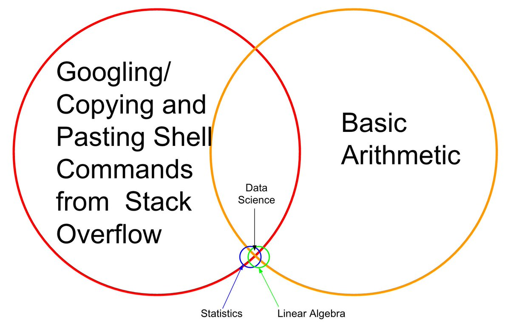

# Math 7360 - Data Analysis - Fall 2023

## Syllabus

### Course Topics

This course provides an applied approach to the statistical analysis of datasets using the R software package.

#### Course Objectives

By the end of this course, you will be able to:

1. Proficiently apply statistical methods in the analysis of real datasets
2. Clearly present results from a data analysis project in both oral and written forms

#### Program-Level Outcomes

Proficiency with data analysis in R

### Lecture and Practicals

Mon 2:00pm - 2:50pm @ Richardson Building 201 and Zoom link <https://tulane.zoom.us/j/96594901794>  
Wed 2:00pm - 2:50pm @ Richardson Building 201 and Zoom link <https://tulane.zoom.us/j/96594901794>  
Fri 2:00pm - 2:50pm Zoom link <https://tulane.zoom.us/j/91892993821>  

### Instructor

[Xiang Ji](https://sse.tulane.edu/math/faculty/ji) 
Office: Gibson 401D 
Email: <xji4@tulane.edu> 
Office hours: Friday lab sessions <https://tulane.zoom.us/j/91892993821>.

### Course Webpage

<https://tulane-math-7360-2023.github.io/>

### Grades

Grades will be based on the homework (70%) and the course project (30%).

#### Course Project timelines

- Form a team of two to work on the project.

- Find a dataset of interest to you.

- Turn in a brief one-page description by the end of week 3 of Sept. 8th. (points: 3/30)

- Submit a mid-term report (2 - 4 pages, no more than 4 please) by the end of week 12 of Nov. 10th. (7/30)

- Present your work to your peers week 15 and 16. (10/30)

- Submit a final report (4 - 8 pages, no more than 8 please) to <xji4@tulane.edu> via email by December 14.

- Submit code to your own private GitHub repository on the course GitHub organization by December 14. (Report + Code, 10/30)

- (Optional, 5 bonus points towards total grade for each individual in team) Make a GitHub page for your project and demo in final presentation.

### Student Resources

There are no required books for this course.  Below is a list of useful resources if you are interested:

1. Reproducible Research with R and RStudio by Christopher Gandrud: [Amazon](https://www.amazon.com/Reproducible-Research-Studio-Second-Chapman/dp/1498715370/ref=dp_ob_title_bk), [GitHub repo](https://github.com/christophergandrud/Rep-Res-Book).
2. [Happy Git with R](https://happygitwithr.com/) by Jenny Bryan.
3. [R Markdown: The Definitive Guide](https://bookdown.org/yihui/rmarkdown/) by Yihui Xie, J.J. Allaire, and Garrett Grolemund.
4. [R for Data Science](https://r4ds.had.co.nz/) by Hadley Wickham and Garrett Grolemund.
5. [Advanced R](http://adv-r.had.co.nz/) by Hadley Wickham.
6. [R Packages](http://r-pkgs.had.co.nz/) by Hadley Wickham.
7. [Rcpp For Everyone](https://teuder.github.io/rcpp4everyone_en/) by Masaki E. Tsuda.

### ADA/Accessibility Statement

Any students with disabilities or other needs, who need special accommodations in this course, are invited to share these concerns or requests with the instructor and should contact Goldman Center for Student Accessibility: http://accessibility.tulane.edu  (Links to an external site.)or 504.862.8433.

### Code of Academic Conduct

The Code of Academic Conduct applies to all undergraduate students, full-time and part-time, in Tulane University. Tulane University expects and requires behavior compatible with its high standards of scholarship. By accepting admission to the university, a student accepts its regulations (i.e., Code of Academic Conduct (Links to an external site.) and Code of Student Conduct (Links to an external site.)) and acknowledges the right of the university to take disciplinary action, including suspension or expulsion, for conduct judged unsatisfactory or disruptive.

### Title IX

Tulane University recognizes the inherent dignity of all individuals and promotes respect for all people. As such, Tulane is committed to providing an environment free of all forms of discrimination including sexual and gender-based discrimination, harassment, and violence like sexual assault, intimate partner violence, and stalking. If you (or someone you know) has experienced or is experiencing these types of behaviors, know that you are not alone. Resources and support are available: you can learn more at allin.tulane.edu.  Any and all of your communications on these matters will be treated as either “Confidential” or “Private” as explained in the chart below. Please know that if you choose to confide in me I am mandated by the university to report to the Title IX Coordinator, as Tulane and I want to be sure you are connected with all the support the university can offer. You do not need to respond to outreach from the university if you do not want. You can also make a report yourself, including an anonymous report, through the form at tulane.edu/concerns.

|Confidential | Private |
|:-----------:|:-------:|
|Except in extreme circumstances, involving imminent danger to one’s self or others, nothing will be shared without your explicit permission.| Conversations are kept as confidential as possible, but information is shared with key staff members so the University can offer resources and accommodations and take action if necessary for safety reasons.|
|Counseling & Psychological Services (CAPS) \| (504) 314-2277 | Case Management & Victim Support Services \| (504) 314-2160 or srss@tulane.edu|
|The Line (24/7) \| (504) 264-6074| Student Affairs Professional On-Call (24/7) \| (504) 920-9900|
|Student Health Center \| (504) 865-5255| Tulane University Police (TUPD) \| Uptown - (504) 865-5911.  Downtown – (504) 988-5531|
|Sexual Aggression Peer Hotline and Education (SAPHE) \| (504) 654-9543| Title IX Coordinator \| (504) 314-2160 or msmith76@tulane.edu|

